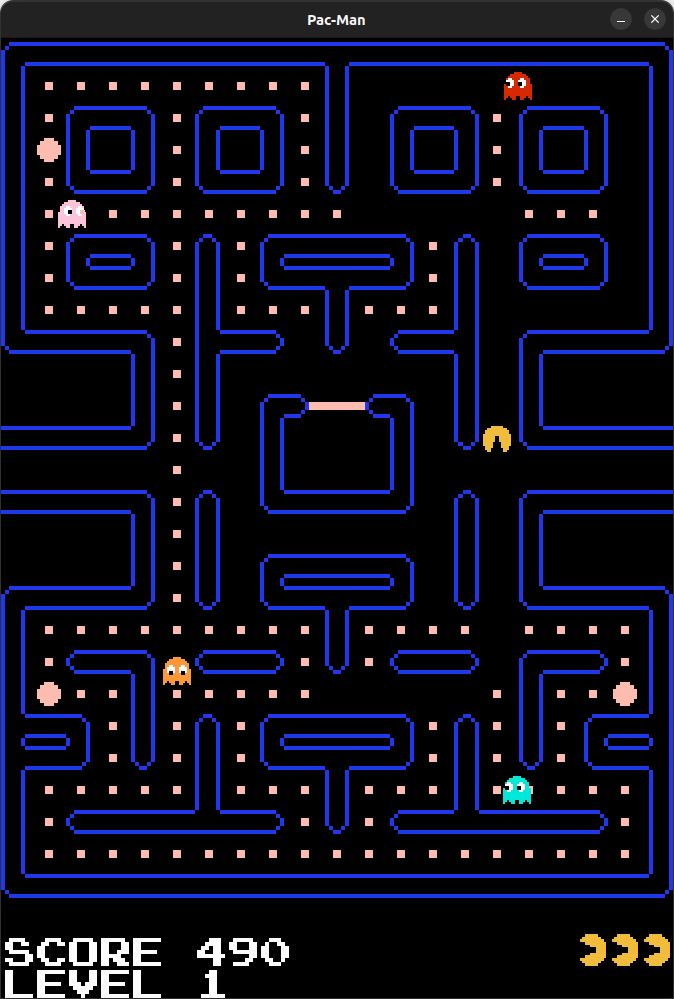

# Pac-Man

## 🕹️ Description

Pac-Man, the video game...



## 🛠 Usage

This project can be built using CMake.

First, set up the *build* folder:
```bash
mkdir build
cd build
cmake -S ../ -B ./
cmake --build ./
```
Then use one of the following command to build the project:
```bash
cmake --build ./
```
```bash
cmake --build ./ -j4 # Use 4 CPU cores
```
Simply launch the program and enjoy!
```bash
./pacman
```

## 🔗 References

- SDL: [Wiki](https://wiki.libsdl.org/SDL2/FrontPage)
- Lazy Foo' Productions: [SDL tutorials](https://lazyfoo.net/tutorials/SDL/index.php)
- Game Developper: [The Pac-Man Dossier](https://www.gamedeveloper.com/design/the-pac-man-dossier)
- Fandom: [Pac-Man Wiki](https://pacman.fandom.com/wiki/Maze_Ghost_AI_Behaviors)
- Microsoft: [Fonctions inline (C++)](https://learn.microsoft.com/fr-fr/cpp/cpp/inline-functions-cpp?view=msvc-170)
- Microsoft: [constexpr (C++)](https://learn.microsoft.com/fr-fr/cpp/cpp/constexpr-cpp?view=msvc-170)
- Geeks for Geeks: [Reference to a pointer in C++ with examples and applications](https://www.geeksforgeeks.org/reference-to-a-pointer-in-c-with-examples-and-applications/)
- Wikipédia: [Algorithme A*](https://fr.wikipedia.org/wiki/Algorithme_A*)

## 👥 Team
- ALLEMAND Fabien
- LEBOT Samuel

## 📋 TODO:
- [ ] Documentation
- [ ] Encapsulation
- [ ] Add **const** and **override**
- [ ] Remove C arrays